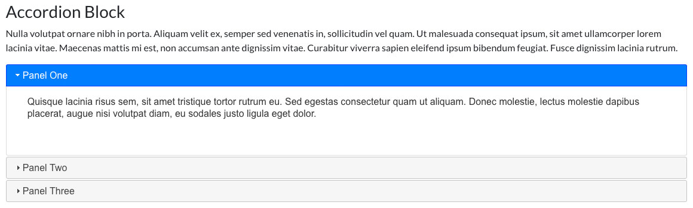
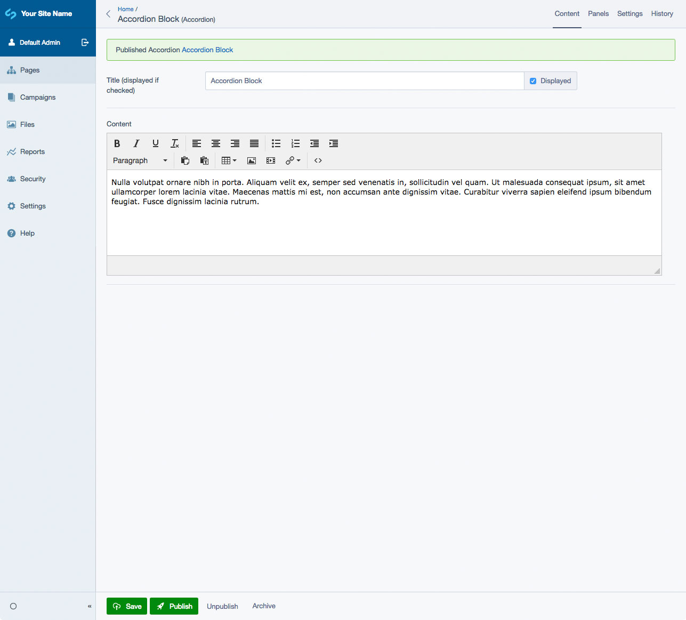
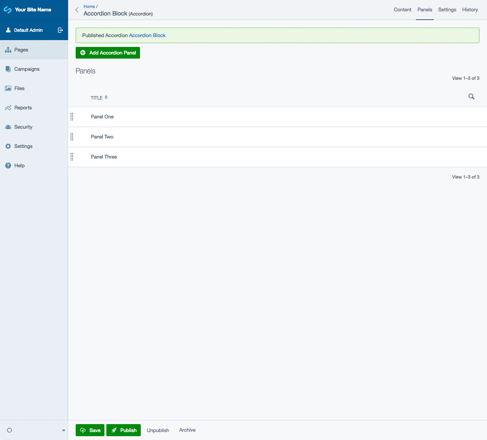
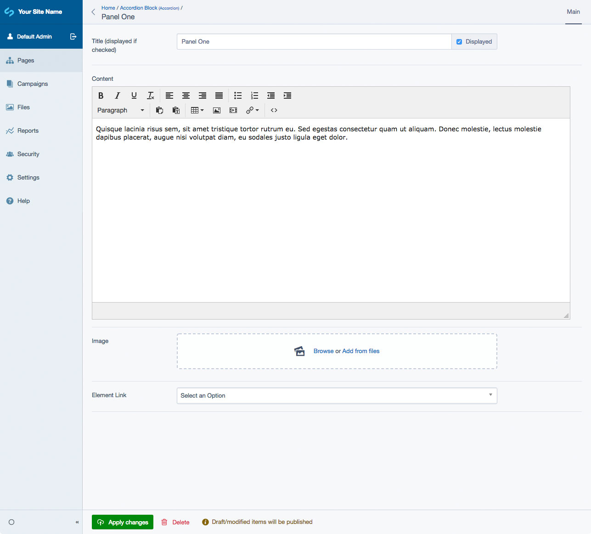

# Silverstripe Elemental Accordion Block

A block that displays content in collapsable panels.

 

## Requirements

* dnadesign/silverstripe-elemental: ^6
* dynamic/silverstripe-elemental-baseobject: ^6
* jonom/focuspoint: ^6.0
* silverstripe/graphql: ^6.0
* symbiote/silverstripe-gridfieldextensions: ^5

## Installation

`composer require dynamic/silverstripe-elemental-accordion`

## Upgrading from version 4

This module drops `gorriecoe/silverstripe-linkfield` usage in favor of `silverstripe/linkfield`.

## Usage

A block that allows you to create collapsible content blocks.

### Template Notes

The default templates are based off [Bootstrap 4](https://getbootstrap.com/) cards and collapse. If a theme is not using bootstrap, panel functionality will need to be implemented based on the theme\'s UX options or via third party scripts such as jQuery UI.

## Screen Shots

#### Front End sample of an Accordion

#### CMS - Accordion Main Tab

#### CMS - Accordion Panel List

#### CMS - Accordion Panel Edit

## Getting more elements

See [Elemental modules by Dynamic](https://github.com/orgs/dynamic/repositories?q=elemental&type=all&language=&sort=)

## Configuration

See [SilverStripe Elemental Configuration](https://github.com/dnadesign/silverstripe-elemental#configuration)

## Maintainers

 *  [Dynamic](https://www.dynamicagency.com) (<dev@dynamicagency.com>)

## Bugtracker

Bugs are tracked in the issues section of this repository. Before submitting an issue please read over existing issues to ensure yours is unique.

If the issue does look like a new bug:

 - Create a new issue
 - Describe the steps required to reproduce your issue, and the expected outcome. Unit tests, screenshots and screencasts can help here.
 - Describe your environment as detailed as possible: SilverStripe version, Browser, PHP version, Operating System, any installed SilverStripe modules.

Please report security issues to the module maintainers directly. Please don't file security issues in the bugtracker.

## Development and contribution

If you would like to make contributions to the module please ensure you raise a pull request and discuss with the module maintainers.

## License

See [License](LICENSE.md)
